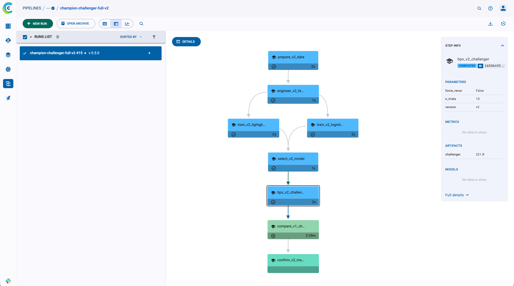

# Model Drift 

A small, production-shaped machine-learning project built around one question: **Can we safely deploy a new model version?**

The project treats model releases as controlled decisions: compare the challenger with the champion on quality and stability, then make an evidence-based recommendation for promotion.

The one place to go is [notebooks/12_full_pipeline.ipynb](notebooks/12_full_pipeline.ipynb)

## The idea in one picture

```text
                           New transaction
                                  │
                         ┌────────┴────────┐
                         │                 │
                        v1                v2
                      champion          challenger
                         │                 │
                         └────────┬────────┘
                                  │
                           compare both
                                  │
             ┌────────────────────┼────────────────────┐
             │                    │                    │
         Quality              Agreement             Drift
             │                    │                    │
      precision/recall       same decision?       JSD / PSI
      F1 / ROC-AUC          where do they flip?   did behaviour move?
             │                    │                    │
             └────────────────────┼────────────────────┘
                                  ▼
                         PROMOTE or REJECT
```

The important distinction is:

```text
Model quality     → "Is v2 correct?"
Model agreement   → "How differently does v2 behave from v1?"
Data drift        → "Has the input population changed?"
```

The goal is not to find a magical single drift number. It is to combine these signals into a practical release decision.

## Architecture



The implementation follows the same flow as the diagram:

```text
                         ┌─────────────────────────┐
                         │           data          │
                         └────────────┬────────────┘
                                      │
                                      ▼
                         ┌─────────────────────────┐
                         │         features        │
                         └────────────┬────────────┘
                                      │
                         ┌────────────┴────────────┐
                         │                         │
                         ▼                         ▼
              ┌─────────────────────┐   ┌─────────────────────┐
              │ logistic_regression │   │      lightgbm       │
              └──────────┬──────────┘   └──────────┬──────────┘
                         │                         │
                         └────────────┬────────────┘
                                      ▼
                         ┌─────────────────────────┐
                         │      select_winner      │
                         └────────────┬────────────┘
                                      │
                                      ▼
                         ┌─────────────────────────┐
                         │           HPO           │
                         └────────────┬────────────┘
                                      │
                                      ▼
                         ┌─────────────────────────┐
                         │  champion_vs_challenger │
                         └────────────┬────────────┘
                                      │
                                      ▼
                         ┌─────────────────────────┐
                         │       promotion         │
                         └─────────────────────────┘
```

The two baseline models are deliberately independent. Logistic Regression gives a simple reference point; LightGBM is the stronger candidate. The current implementation then tunes the selected model with Optuna and finally compares the resulting challenger with the saved v1 champion on the same holdout.

## Data split

```text
v1:  [========== train ==========][valid][test]
v2:       [========== train ==========][valid][test]
         └──── 7-day freshness shift ────┘
```

## What do the metrics mean?

### Model quality

| Metric name | Question it answers | Rough interpretation |
| --- | --- | --- |
| **Precision** | When model marks, how often is the model right? | 0% = always wrong, 100% = every flagged case is fraud |
| **Recall** | Of all real signals, how much did the model catch? | 0% = caught none, 100% = caught all |
| **F1** | Can we balance precision and recall? | Higher is better; 1.0 is perfect |
| **ROC-AUC** | Is the model guessing at random or not? | 0.50 ≈ random, ~0.70 useful, ~0.90+ strong |
| **PR-AUC** | How good is the model when signal is relatively rare? | Higher is better; especially useful for imbalanced data |

### Model behaviour

| Metric name | Question it answers | Rough interpretation |
| --- | --- | --- |
| **Agreement** | Do v1 and v2 make the same decision? | 100% = identical decisions; lower means more prediction changes |
| **Score JSD** | Did the output score distributions move? | 0 = identical; 0.05 = very similar; 0.20 noticeably different; larger values (0.5+) mean increasingly different distributions |
| **Max PSI** | Did an input move away from its reference? | < 0.10 is usually considered stable; 0.10–0.25 deserves attention; > 0.25 is significant drift |

## Final comparison: what actually happened?

The v1 champion and v2 challenger were evaluated on the same holdout population.

```jsonc
{
  "precision": { "v1": 0.702611, "v2": 0.703690 }, // v2 is slightly better
  "recall":    { "v1": 0.333601, "v2": 0.330033 }, // v2 catches slightly less fraud
  "f1":        { "v1": 0.452401, "v2": 0.449329 }, // v1 is slightly better overall balance
  "roc_auc":   { "v1": 0.855241, "v2": 0.855949 }, // v2 has slightly better ranking
  "pr_auc":    { "v1": 0.392633, "v2": 0.392304 }, // essentially unchanged, tiny v1 edge

  "agreement": 0.9993, // 99.93% of decisions are identical: behaviour is very stable
  "score_jsd": 0.0004, // extremely small distribution change
  "max_psi":   0.0239, // comfortably below the 0.10 drift guardrail

  "promotion_suggestion": "PROMOTE v2"
}
```

The interesting part is that **v2 is not a runaway winner**. Its quality metrics are mixed: precision and ROC-AUC improve very slightly, while recall, F1 and PR-AUC are essentially flat or marginally worse.

What is strong is the stability signal:

```text
99.93% agreement       ████████████████████░
JSD = 0.0004           █░
PSI = 0.0239           ████░░░░░░░░░░░░░░░░
```

So the recommendation is **PROMOTE v2**, but the result should be read as **“v2 is a safe, very small change”**, not **“v2 is dramatically better”**. The final promotion remains a human decision in the ClearML pipeline.

## Getting started

```bash
uv sync
docker compose -f build/compose.yml -p cross-model-drift up -d
```

The pipeline is orchestrated with [ClearML](https://clear.ml/) and runs locally. ClearML UI is available at [http://localhost:8080](http://localhost:8080)
